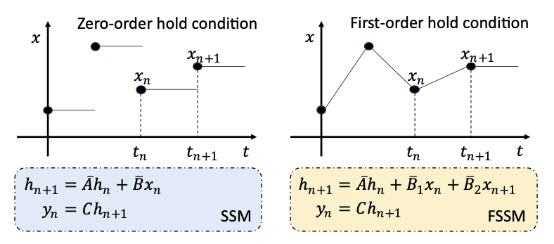

<p align="center">
    
</p>

# [ICASSP 2025 Oral] FMamba



> **First-order State Space Model for Lightweight Image Super-resolution**\
> Yujie Zhu, Xinyi Zhang, Yekai Lu, Guang Yang, Faming Fang, Guixu Zhang\
> Paper: https://arxiv.org/abs/2509.08458

## About

This is the core module in our work [FMambaIR](https://github.com/Edlinf/FMambaIR), which can be installed separately as a package to replace the SSM module in Mamba.

## Installation

Built from source with `pip install .` from this repository.

For installation requirement and details, please refer to [Mamba](https://github.com/state-spaces/mamba).

## Citation

If you use this codebase, or otherwise found our work valuable, please cite 🐷Mamba

```
@inproceedings{zhu2025first,
  title={First-order State Space Model for Lightweight Image Super-resolution},
  author={Zhu, Yujie and Zhang, Xinyi and Lu, Yekai and Yang, Guang and Fang, Faming and Zhang, Guixu},
  booktitle={ICASSP 2025-2025 IEEE International Conference on Acoustics, Speech and Signal Processing (ICASSP)},
  pages={1--5},
  year={2025},
  organization={IEEE}
}
```


## Acknowledgement

This code is based on [Mamba](https://github.com/state-spaces/mamba),and [MambaIR](https://github.com/csguoh/MambaIR). Thanks for their awesome work.
